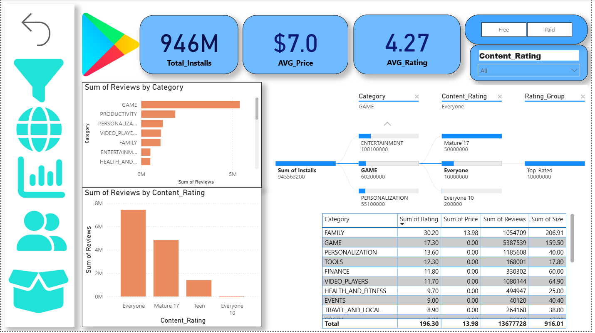

# 📊 Google Play Store App Analytics Dashboard | Power BI Project

<p align="center">
  
</p>

---

## 📌 Project Overview

The Google Play Store App Analytics Dashboard is an interactive Power BI project designed to analyze and visualize mobile application market data.

This dashboard transforms raw Play Store data into meaningful insights to support business decision-making and market strategy development.

It focuses on:

- App install trends
- Category-wise performance
- Pricing analysis
- User ratings & review behavior
- Content rating distribution

---

## 🎯 Business Objective

The objective of this project is to:

- Identify high-performing app categories
- Analyze pricing strategies of paid vs free apps
- Study user rating distribution
- Understand review engagement patterns
- Enable data-driven strategic decisions

---

## 📈 Key Performance Indicators (KPIs)

- 📥 946M+ Total Installs
- 💲 $7.0 Average Price
- ⭐ 4.27 Average Rating

---

## 📊 Key Insights Derived

- 🎮 The Game category dominates in installs and reviews
- 👨‍👩‍👧 “Everyone” content rating represents the majority of apps
- 💰 Paid apps follow distinct pricing distribution patterns
- 📊 Review analysis reveals strong engagement in specific categories
- 📈 Category-wise trends help understand market positioning

---

## 🛠 Tools & Technologies Used

- Power BI – Dashboard Development
- Power Query – Data Cleaning & Transformation
- DAX – KPI & Measure Creation
- Microsoft Excel – Data Preparation
- Data Modeling Techniques

---

## 📂 Project Structure

```
App-Analytics-Dashboard/
│
├── Dashbord.png
├── Play_store.pbix
├── README.md
│
└── Project_Data/
    ├── cleaned_ps_data.xlsx
    ├── cleaned_ur_data.xlsx
    ├── Customer_Icon_Blue.png
    ├── Dashboard_Icon_Blue.png
    ├── Filter_Icon_Blue.png
    ├── Map_Icon_Blue.png
    ├── Product_Icon_Blue.png
    ├── google-play.png
    └── Project_layout_points (1).docx
```

## 🚀 Skills Demonstrated

- Data Cleaning & Transformation
- Data Modeling
- KPI Development
- DAX Measures
- Interactive Dashboard Design
- Business Insight Generation
- Analytical Thinking

---

## 📷 Dashboard Preview

The dashboard provides a clear and interactive visualization of:

- Total installs by category
- Review distribution
- Pricing insights
- Rating performance
- Content rating segmentation

---

## 💡 Learning Outcomes

Through this project, I enhanced my skills in:

- Real-world dataset handling
- Designing business-focused dashboards
- Writing optimized DAX formulas
- Creating visually structured reports
- Extracting actionable insights from data

---

## 👨‍💻 Author

Raushan Kumar  
Aspiring Data Analyst | Power BI Developer

📊 Skilled in: Power BI, Excel, DAX, Data Cleaning  
📈 Interested in: Data Analytics, Business Intelligence, Data Visualization
